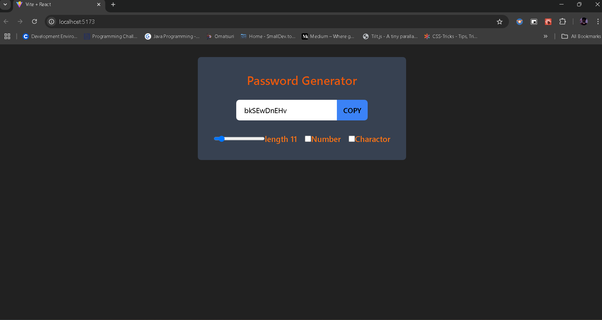

# Setup our project 
- create projet (react+vite)
- install tailwind css
- change tailwind config file

# I create random password generator
- it has one Input, Button, range, checkbox to generators the random incripted password

# I use useState to handle it
- like Input, Button, range, checkbox 

# what is useRef -:
- useRef is a hook that provides a way to persist values across renders without causing a re-render when updated. It is mainly used to reference DOM elements directly and store mutable values that do not trigger re-renders when changed.

## used in my learning project
- i used useRef in password field to give access those value by copy button

# useEffect -:
- useEffect is a powerful hook that allows you to perform side effects in functional components. useEffect provides a way to manage these effects in a way that aligns with React's rendering lifecycle.

# methods :-
## passwordGenerator -
- this method generates the random password using number, string, and special charactor like(RdcE1/&23Erv)

## copyToClipBoard -
- this give the access to copy password from password input fields 

## we used th onclick and onchange even to change the state
- Range of string value, Number & charactor encluded in password

# Style 
- for styling i used tailwind css which is framework of css 

