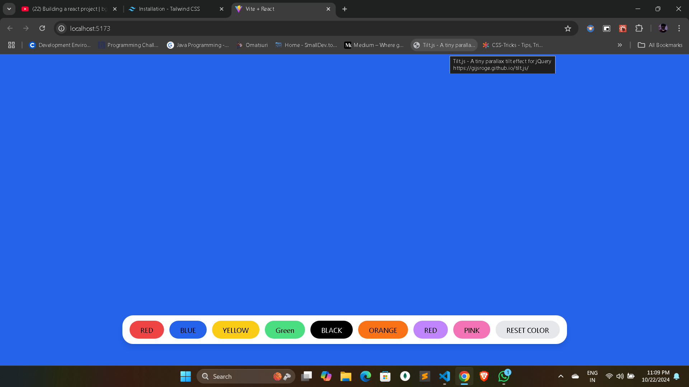

# React + Vite
# step 1 -:
- create vite app 
- install tailwind css 
- setup all files
# Step 2 -:
- I create a simple backgound color changer and we create a ribbon inside the ribbon different types of color bottuns when click the btn color will be changed
- this doing we used usestate to change the state of color
- when we click on the buttons then color will change accordigly 
- On the button we used onclick event to haldle the color changes

- 
