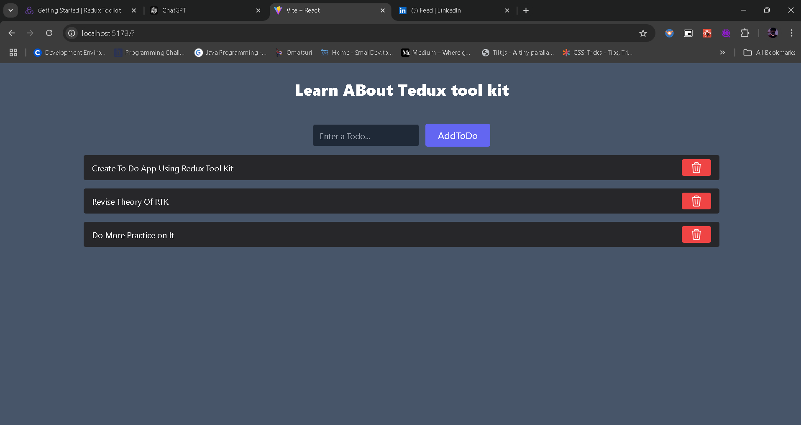

# React + Vite

# Redux Tool Kit 
- Redux Toolkit (RTK) is a library that simplifies working with Redux, a state management library for JavaScript applications. RTK provides tools and abstractions that reduce boilerplate code, streamline state management, and make it easier to implement best practices. It is the officially recommended way to use Redux in modern applications.

## Why Use Redux Toolkit?
- Reduces boilerplate code.
- Encourages good Redux practices.
- Handles common use cases like asynchronous actions and state immutability.
- Enhances developer productivity.

# Store
- The store is the central repository of your application's state in Redux. It:
- Holds the entire state tree of your app.
- Allows access to the current state via store.getState().
- Dispatches actions to modify the state via store.dispatch(action).
- Registers listeners with store.subscribe(listener) to respond to state changes.
In a typical Redux setup, you create a store using the configureStore or createStore function:

## useDispatch
The useDispatch hook is used in React components to dispatch actions to the Redux store. This triggers state changes based on the corresponding reducers.
Key Points:
- It provides access to the dispatch function from the Redux store.
- You use it to send actions (e.g., increment, decrement) to update the state.

## useSelector
The useSelector hook is used in React components to read data from the Redux store. It subscribes to the store and re-renders the component whenever the selected state changes.
Key Points:
- It allows you to extract specific slices of the state from the Redux store.
- Automatically manages subscriptions, so the component updates when the state it depends on changes.

# Example: Counter Application with Redux Toolkit
import { configureStore, createSlice } from '@reduxjs/toolkit';
// Step 1: Create a slice
const counterSlice = createSlice({
name: 'counter',
initialState: { value: 0 },
reducers: {
increment: (state) => {
state.value += 1;
},
decrement: (state) => {
state.value -= 1;
},
incrementByAmount: (state, action) => {
state.value += action.payload;
},
},
});
// Export actions
export const { increment, decrement, incrementByAmount } = counterSlice.actions;
// Step 2: Configure the store
const store = configureStore({
reducer: {
counter: counterSlice.reducer,
},
});
export default store;
// Usage in a component
// import { useDispatch, useSelector } from 'react-redux';
// import { increment, decrement, incrementByAmount } from './store';